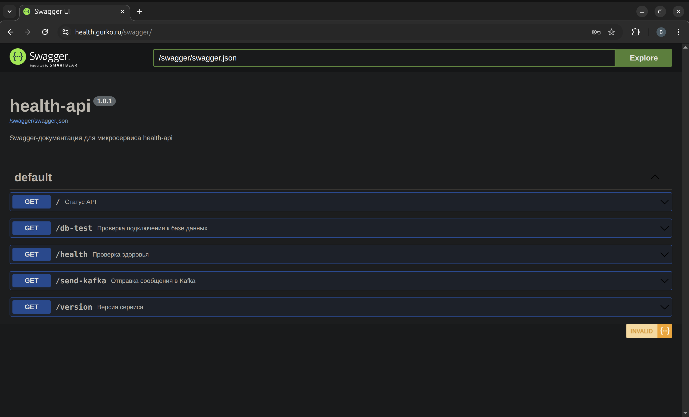

# Оглавление  

- [О проекте](#о-проекте)  
  - [Связанные репозитории](#связанные-репозитории)  
  - [Монорепо](#монорепо)  
  - [Цель репозитория](#цель-репозитория)  
- [Стек](#стек)  
  - [Инфраструктура](#инфраструктура)  
  - [CI/CD](#cicd)  
  - [Безопасность / DevSecOps](#безопасность--devsecops)  
  - [Веб-приложение](#веб-приложение)  
  - [Observability](#observability)  
- [Архитектура (MVP в проде)](#архитектура-mvp-в-проде)  
  - [Под капотом](#под-капотом)  
  - [Yandex Cloud структура](#yandex-cloud-структура)  
- [Архитектура (локальная)](#архитектура-локальная)  
  - [infra_compose/: Расширенная версия в Docker Compose](#infra_compose-расширенная-версия-в-docker-compose)  
    - [Эндпоинты и интерфейсы](#эндпоинты-и-интерфейсы)  
    - [Эндпоинты в режиме override](#эндпоинты-в-режиме-override)  
  - [MVP-версия в Minikube](#mvp-версия-в-minikube)  
    - [Сервисы](#сервисы)  
- [backend/: Backend-сервис](#backend-backend-сервис)  
- [frontend/: Frontend-сервис](#frontend-frontend-сервис)  
- [e2e_tests/: End-to-End тесты](#e2e_tests-end-to-end-тесты)  
- [Makefile](#makefile)  
- [CI/CD структура (GitHub Actions)](#cicd-структура-github-actions)  
  - [Успешный прогон](#успешный-прогон)  
  - [Артефакты](#артефакты)  
- [Bash-скрипты](#bash-скрипты)  
- [ansible/: Ansible-автоматизация](#ansible-ansible-автоматизация)  
- [helm/: Структура для Dev и Prod](#helm-структура-для-dev-и-prod)  
- [terraform/: Terraform-инфраструктура](#terraform-terraform-инфраструктура)  
- [Безопасность](#безопасность)  
  - [security_local/config](#security_localconfig)  
  - [security_local/policy](#security_localpolicy)  
  - [.pre-commit-config.yaml](#pre-commit-configyaml)  

---

# О проекте  

Данный репозиторий — **монорепо-портфолио**, демонстрирующее полный цикл **ручного деплоя** MVP веб-приложения [`health-api`](https://github.com/vikgur/health-api-for-microservice-stack) в **Yandex Cloud** по паттерну *manual-deploy*.  

Также репозиторий включает сценарии для локальной отладки:  
- [**Расширенная версия**](#infra_compose-расширенная-версия-в-docker-compose) проекта в `docker-compose` (18 контейнеров);  
- [**MVP-версия**](#mvp-версия-в-minikube) в `Minikube`.  

## Связанные репозитории  

**Infrastructure / DevOps**  
- [terraform-yandex-cloud-health-api](https://github.com/Vikgur/terraform-yandex-cloud-health-api) — Terraform-инфраструктура  
- [ansible-manual-health-api](https://github.com/Vikgur/ansible-manual-health-api) — Ansible-автоматизация  
- [helm-blue-green-canary-manual-health-api](https://github.com/Vikgur/helm-blue-green-canary-manual-health-api) — Helm/Helmfile для Dev и Prod  
- [ci-manual-tag-deploy-health-api](https://github.com/Vikgur/ci-manual-tag-deploy-health-api) — CI/CD пайплайны (GitHub Actions)  
- [bash-scripts-health-api](https://github.com/Vikgur/bash-scripts-health-api) — Bash-скрипты для деплоя и автоматизации  
- [k8s-local-minikube-health-api](https://github.com/Vikgur/k8s-local-minikube-health-api) — локальный запуск MVP в Minikube  
- [infra-docker-compose-health-api](https://github.com/Vikgur/infra-docker-compose-health-api) — локальная инфраструктура (18 контейнеров)  

**Application**  
- [backend-health-api](https://github.com/Vikgur/health-api-for-microservice-stack) — Flask backend  
- [frontend-health-api-ui](https://github.com/Vikgur/health-api-ui-for-microservice-stack) — React/Vite frontend  

**Testing**  
- [e2e-tests-health-api](https://github.com/Vikgur/e2e-tests-health-api-for-microservice-stack) — E2E тесты (Pytest + Allure)  

## Монорепо  

- **Авторский демонстрационный стенд** реальной микросервисной архитектуры.  
- Полностью реализованная обвязка: **CI/CD, DevSecOps, Observability**.  
- Сценарий сквозного деплоя: от инфраструктуры как кода до продового приложения.  
- Использован стек технологий уровня продакшена:  
  - **Terraform** — инфраструктура  
  - **Ansible** — автоматизация конфигураций  
  - **Helm/Helmfile** — деплой в Kubernetes  
  - **GitHub Actions (CI)** — пайплайны и проверки  
  - **k8s/k3s** — оркестрация  
  - **Docker** — контейнеризация  

## Цель репозитория  

- Зафиксировать **end-to-end паттерн ручного деплоя**.  
- Показать, как разные инструменты собираются в единый DevOps-процесс без GitOps/Argo CD.  
- Служить демонстрацией «живого» продового окружения, построенного полностью вручную.  

---

# Стек  

Проект охватывает **полный технологический спектр**, используемый в продакшен-инфраструктуре: от IaC и CI/CD до мониторинга и DevSecOps. Ниже перечислены все технологии, сгруппированные по уровням с указанием их роли.  

## Инфраструктура 

Управление инфраструктурой и контейнерами:

- **IaC:** Terraform, Ansible, Bash, Make  
- **Kubernetes:** K3s, Minikube, Helm, Helmfile, Ingress, Cert-manager  
- **Containerization:** Docker  

## CI/CD  

Автоматизация сборки, тестирования и доставки:  

- **Pipeline:** GitHub Actions  
- **Code style & formatting:** Black, Isort  
- **Unit & integration tests:** Pytest, Flake8  

## Безопасность / DevSecOps  

Защита цепочки поставки, анализ кода и проверка инфраструктуры.  

**CI:**  
- **Supply chain:** Cosign (подпись и верификация образов)  
- **Secrets & leaks:** Gitleaks  
- **Static analysis (SAST):** Semgrep, Flake8, Black, Isort  
- **Vulnerability scanning (SCA):** Trivy FS, Trivy Image  
- **Policy & compliance:** Polaris, Helmfile lint, Yamllint, Shellcheck, Dotenv-linter, Kubeconform  

**CD:**  
- Проверка `.env`, `docker-compose config`  
- Manual approval перед продом  
- Деплой только trusted-образов из GHCR (подписанных Cosign)  

**Локально:**  
- **Policy-as-Code:** OPA/Conftest (Terraform, Kubernetes)  
- **Infrastructure scanning:** Checkov, TFLint  
- **Unit-тесты политик:** rego security_test.rego (Kubernetes)  

## Веб-приложение 

Сервисы и компоненты приложения:

- **Backend:** Python (Flask), Pytest  
- **Frontend:** React, Vite  
- **Тестирование:** Pytest, Allure  
- **Документация:** Swagger UI  
- **Брокеры:** Kafka, Zookeeper, Redpanda Console  
- **БД:** PostgreSQL, PgBouncer  

## Observability 

Контроль, метрики и трассировка:

- **Monitoring & metrics:** Prometheus, VictoriaMetrics, Alertmanager  
- **Visualization:** Grafana  
- **Tracing:** Jaeger  
- **Экспортёры:** Postgres-exporter, Pgbouncer-exporter, Kafka-exporter  

---

# Архитектура (MVP в проде)  

UI с 4 кнопками, все запросы проходят через `nginx`:  

  

- **Ping API** — проверка доступности API  
- **Health Check** — self-check сервиса  
- **Get Version** — версия backend  
- **DB Test** — подключение к PostgreSQL (insert пользователя)  

Дополнительно:  

- **Swagger:**
  > Эндпоинт Swagger защищён авторизацией через `nginx`: `admin` / `admin`  

  

## Под капотом  

- Монорепозиторий с CI/CD и DevSecOps.  
- Локально — **Minikube**, в проде — кластер **k3s** на 3 VPS в **Yandex Cloud**.  
- Деплой и управление — через **Helm + Helmfile**.  
- Приложение работает в Kubernetes: автоскейлинг, самовосстановление, изоляция, масштабирование.  
- HTTPS через **cert-manager + Let's Encrypt**.  
- Все образы собираются и тегируются в CI/CD, пуш — вручную.  
- Используются встроенные компоненты k3s:  
  - `CoreDNS` — DNS внутри кластера  
  - `local-path-provisioner` — локальное хранилище  
  - `metrics-server` — HPA и мониторинг  
  - `svclb` — балансировка доступа к ingress-контроллеру  

## Yandex Cloud структура

---

# Архитектура (локальная)  

## infra_compose/: Расширенная версия в Docker Compose  

Запускается полный технологический стек проекта.  

Проект построен по принципу **декомпозиции**:  
- `backend` (`health-api`) и `frontend` (`health-api-ui`) — независимые сервисы, собираемые в отдельные Docker-образы.  

**Итого разворачивается 18 контейнеров**, среди них:  

- 2×`health-api` (для балансировки),  
- `nginx` — reverse proxy,  
- `swagger-ui` — REST-документация,  
- `health-api-frontend` — SPA UI,  
- `Kafka`, `Zookeeper`, `Redpanda Console`,  
- `Postgres`, `PgBouncer`,  
- observability-стек: `Prometheus`, `VictoriaMetrics`, `Grafana`, `Jaeger`, `Alertmanager`,  
- экспортёры: `pgbouncer-exporter`, `postgres-exporter`, `kafka-exporter`.  

### Эндпоинты и интерфейсы

Все маршруты проксируются через `nginx` и защищены **базовой авторизацией** (`.htpasswd`, логин: `admin`, пароль: `admin`).

| Назначение            | URL                                | Описание                                            |
|-----------------------|-------------------------------------|-----------------------------------------------------|
| API root              | http://localhost/                  | Главная точка API (`health-api`) через `nginx`      |
| API: /health          | http://localhost/health            | Проверка статуса API                                |
| API: /version         | http://localhost/version           | Версия сервиса                                      |
| Swagger UI            | http://localhost/swagger/          | Swagger-документация API                            |
| UI (SPA)              | http://localhost/ui/                | UI-витрина, ручное тестирование, демо
| API: /api/            | http://localhost/api/...            | API-прокси для SPA |
| API: /db-test         | http://localhost/db-test           | Проверка подключения к базе через PgBouncer         |
| API: /send-kafka      | http://localhost/send-kafka        | Отправка тестового сообщения в Kafka                |
| Kafka UI              | http://localhost:8084/             | Интерфейс Kafka (Redpanda Console)                  |
| Метрики API           | http://localhost/metrics           | Метрики `health-api` (`prometheus_flask_exporter`) |
| Grafana               | http://localhost:3000/             | Графики и дашборды                                  |
| VictoriaMetrics       | http://localhost:8428/             | Интерфейс VictoriaMetrics                           |
| Prometheus            | http://localhost:9090/             | Интерфейс Prometheus                                |
| Alertmanager          | http://localhost:9093/             | Управление алертами                                 |
| Jaeger UI             | http://localhost:16686/            | Трассировка запросов                                |
| PgBouncer Exporter    | http://localhost:9127/metrics      | Метрики пула соединений PgBouncer                  |
| Kafka Exporter        | http://localhost:9308/metrics      | Метрики Kafka-брокера, топиков и партиций          |
| Postgres Exporter     | http://localhost:9187/metrics      | Метрики состояния PostgreSQL, активных подключений |

### Эндпоинты в режиме override

| Назначение                                 | URL                                | Комментарий                                |
|--------------------------------------------|-------------------------------------|---------------------------------------------|
| Корневой эндпоинт `health-api-1`           | http://localhost:8081/             | Контейнер из `override` (отладка)           |
| Проверка статуса API                       | http://localhost:8081/health       |                                              |
| Версия API                                 | http://localhost:8081/version      |                                              |
| Тест соединения с базой через PgBouncer    | http://localhost:8081/db-test      |                                              |
| Отправка сообщения в Kafka                 | http://localhost:8081/send-kafka   |                                              |
| Метрики `health-api`                       | http://localhost:8081/metrics      | Подхватываются Prometheus                   |

## MVP-версия в Minikube  

MVP запускается локально в **Minikube** и служит для отработки полного цикла DevOps. Управление осуществляется через **Helm**.  

Используются готовые чарты (например, Bitnami PostgreSQL) и кастомные (backend, frontend, nginx, swagger), настроенные по best practices: probes, ресурсы, стратегии деплоя, безопасность, HPA, rollout-контроль и DRY через helpers.  

### Сервисы  
- **backend** — Flask API (2 пода для балансировки).  
- **frontend** — React SPA (Vite).  
- **postgres** — база данных.  
- **nginx** — ingress и точка входа.  
- **swagger** — OpenAPI UI.  
- **jaeger** — заглушка (backend шлёт трейсы в `app.py`).  

> Подробное описание и инструкции — в отдельном репозитории [k8s-local-minikube-health-api](https://github.com/Vikgur/k8s-local-minikube-health-api).  
 
---

# backend/: Backend-сервис  

В `backend/` находится API на **Python (Flask)** с базовой бизнес-логикой, health-check эндпоинтами и подключением к PostgreSQL и Kafka. Для unit-тестирования используется **Pytest**, конфигурация обернута в Dockerfile и Helm-чарт.  

> Подробное описание сервиса и его кода — в отдельном репозитории [backend-health-api](https://github.com/Vikgur/health-api-for-microservice-stack).  

# frontend/: Frontend-сервис  

В `frontend/` реализован SPA-интерфейс на **React + Vite**, который взаимодействует с backend через REST API. Проект упакован в Docker-образ, статика отдаётся через Nginx, доступна интеграция со Swagger UI.  

> Подробное описание реализации и сборки фронтенда — в отдельном репозитории [frontend-health-api-ui](https://github.com/Vikgur/health-api-ui-for-microservice-stack).  

---

# e2e_tests/: End-to-End тесты  

В `e2e_tests/` собраны **E2E тесты** на Python (**Pytest + Allure**) для проверки функциональности приложения в проде и стейдже. Тестируются основные сценарии UI и API, используется отдельный CI workflow.  

> Подробное описание структуры тестов и генерации отчетов — в отдельном репозитории [e2e-tests-health-api](https://github.com/Vikgur/e2e-tests-health-api-for-microservice-stack).  

---

# Makefile  

Makefile в корне репозитория служит фасадом для локальной работы:  

- **help** — список доступных команд.  
- **compose-up / down / logs** — запуск, остановка и просмотр логов полной версии (18 контейнеров) в Docker Compose.  
- **mvp-up / down / logs** — запуск и управление упрощённой MVP-версией (9 контейнеров).  
- **helm-dev / prod / diff** — применение конфигураций Dev и Prod через Helmfile.  
- **iac-check / k8s-check / code-check / image-scan / secrets** — локальные DevSecOps-проверки (Terraform, K8s, код, образы, секреты).  
- **links** — ссылки на все связанные репозитории.  
- **version / print-env** — вспомогательные утилиты (версия, параметры окружения).  

Файл сделан в минимальной форме для демонстрации инфраструктуры и локальной отладки, но при необходимости может быть расширен новыми командами.    

---

# CI/CD структура (GitHub Actions)  

Единый CI/CD реализован через **GitHub Actions** для каталогов:  
- `backend/` — API (Flask) + unit-тесты.  
- `frontend/` — SPA (React + Vite).  
- `e2e_tests/` — e2e-тесты (Pytest + Allure).  
- `helm/` — чарты и Helmfile для прод-деплоя.  
- `infra/` — `nginx` и docker-compose для всех 18 контейнеров.  
- `mvp_compose/` — упрощённый прод-стек (9 контейнеров).  

Workflow:  
- `.github/workflows/ci-deploy.yml` — основной CI/CD-процесс.  
- `.github/workflows/release-image.yml` — релиз backend/frontend образов.  
- `.github/workflows/prod-deploy.yml` — ручной прод-деплой.  

## Успешный прогон

  

## Артефакты

  

> Подробная структура и описание пайплайна — в отдельном репозитории [ci-manual-tag-deploy-health-api](https://github.com/Vikgur/ci-manual-tag-deploy-health-api). 

---

# Bash-скрипты  

В проекте используется набор **Bash-скриптов** для автоматизации рутинных шагов: генерация инвентаря Ansible, синхронизация файлов на мастер-ноду, запуск плейбуков и вспомогательные операции при деплое.  

Скрипты оформлены по best practices: проверка аргументов, `set -euo pipefail`, логирование шагов и минимизация ручных действий.  

> Подробное описание и полный набор скриптов — в отдельном репозитории [bash-scripts-health-api](https://github.com/Vikgur/bash-scripts-health-api).  

---

# ansible/: Ansible-автоматизация  

В `ansible/` реализованы роли для установки и настройки **k3s-кластера**, а также деплоя приложения через Helmfile. Окружения разделены на stage и prod, конфигурации хранятся в `inventories/`.  

> Подробное описание ролей, плейбуков и DevSecOps-практик — в отдельном репозитории [ansible-manual-health-api](https://github.com/Vikgur/ansible-manual-health-api).  

---

# helm/: Структура для Dev и Prod  

В `helm/` хранится единый набор чартов и values для Dev и Prod, реализованы стратегии деплоя **Blue/Green** и **Canary**. Dev и Prod используют одни и те же чарты, различия задаются только через values.  

> Подробное описание внедренных стратегий деплоя, Kubernetes Best Practices в Helm-чартах и DevSecOps-практик — в отдельном репозитории [helm-blue-green-canary-manual-health-api](https://github.com/Vikgur/helm-blue-green-canary-manual-health-api).  

---

# terraform/: Terraform-инфраструктура  

В `terraform/` описана IaC-инфраструктура в **Yandex Cloud**: сети, ВМ под кластер k3s и сопутствующие ресурсы. Используется backend в Object Storage, переменные вынесены в tfvars.  

> Подробное описание инфраструктуры и DevSecOps-практик — в отдельном репозитории [terraform-yandex-cloud-health-api](https://github.com/Vikgur/terraform-yandex-cloud-health-api).  

---

# Безопасность

В проект встроен слой **DevSecOps**: используются baseline-конфигурации для статического анализа, поиска секретов, сканирования уязвимостей и аудита Kubernetes/ Terraform через Policy-as-Code. Основные настройки собраны в `security_local/config`, а правила в `security_local/policy`.

## security_local/config  

Конфигурации для инструментов **DevSecOps**:  

- **checkov/base.yaml** — baseline для анализа Terraform и Kubernetes.  
- **semgrep/base.yml** — правила статического анализа кода.  
- **gitleaks/base.toml** — поиск секретов и ключей.  
- **polaris/polaris.yaml** — аудит Kubernetes-манифестов на best practices.  
- **trivy/trivy.yaml** — сканирование файловой системы и образов.  
- **yamllint/yamllint.yaml** — проверка YAML (Helm, Ansible, CI) на стиль и ошибки.  

## security_local/policy  

Правила **Policy-as-Code** для проверки инфраструктуры и Kubernetes-манифестов через **OPA/Conftest**:  

- **terraform/security.rego** — проверки Terraform (запрет `0.0.0.0/0`, требование тегов, KMS для storage).  
- **kubernetes/security.rego** — проверки Pod/Deployment/Service (`runAsNonRoot`, запрет privileged, hostNetwork/hostPID/hostIPC, обязательные requests/limits).  
- **kubernetes/security_test.rego** — unit-тесты rego-правил.  

## .pre-commit-config.yaml  

Конфигурация хуков **pre-commit** для автоматических проверок перед коммитом.  
Включает:  

- **Python**: Black, Isort, Flake8 — форматирование и стиль.  
- **Frontend**: Prettier — форматирование JS/TS/JSON/YAML/Markdown.  
- **Bash**: Shellcheck — статический анализ скриптов.  
- **YAML**: Yamllint — проверка структуры и стиля.  
- **Dotenv**: dotenv-linter — валидация `.env` файлов.  
- **Kubernetes**: Helm lint, Helmfile lint, Kubeconform — валидация чартов и манифестов.  
- **Generic**: trailing-whitespace, end-of-file-fixer, detect-private-key и др.  

Используется для унификации кода, раннего выявления ошибок и обеспечения качества на локальном этапе разработки.  
